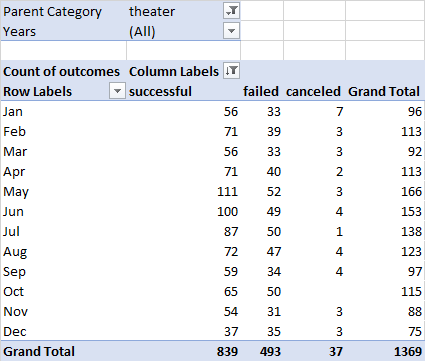
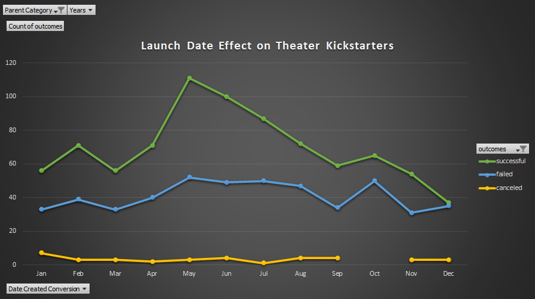
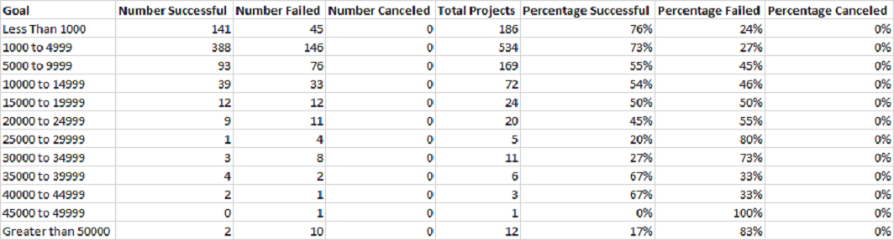
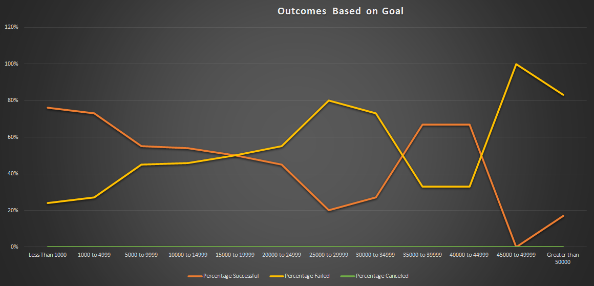

# Kickstarting with Excel
---
## Overview of Project
---
### Purpose
---
 

After kickstarting her play *Fever*, Louise wondered how launch dates and funding goals affected a campaign's outcome. I analyzed data collected from multiple countries with a wide range of goal amounts and launch dates. My focus was on theater followed more specifically by plays. 
 

---
## Analysis and Challenges
---
 

Before being able to begin my analysis, I had to filter the data to fit Louise's questions. Process is broken down below.  
 

---
### Analysis of Outcomes Based on Launch Date
---
 

Louise's first question dealt with theater campaign outcomes based on their launch dates. I was able to pull enough information from the data set to create a pivot table. My focus was on whether each campaign ended up "successful", "failed", or "canceled". Utilizing the capabilities of a pivot table, I was able to break down the data collected over the years to show the trends by month. See Table 1. 
 

 

*Table 1: Pivot table created in Excel showing total number of theater campaigns for each month broken down into successful, failed, and canceled.* 
 

From Table 1 I created a line chart that showed which months had the highest rate of success. Please see below.

  
 
*Figure 1: Line chart demonstrating trends by month over multiple years for theater campaigns.* 
 

---
### Analysis of Outcomes Based on Goals
---
 

Louise's second question was how goal amounts affected a campaign's success or failure. In order to find the answer to this, I relied on Excel's formulas rather than a pivot table. I wanted to extract play campaign data, and organize it based on ranges of goal funding. This was achieved through the COUNTIFS function, which sifted through the data sheet to pull numbers of successful, failed, and canceled plays at each goal range amount I set.
 

Once that was completed, I totalled up the projects by using the SUM function across the rows. This allowed me to calculate the percentage of successful, failed, and canceled campaign for each goal bracket. Please see Table 2.
 

*Table 2: Goal brackets of play campaigns broken down into number of successful, failed, and canceled. Final columns show calculated percentages for each range.* 
 
To make the data even more presentable, I then created a line chart of the percentages across the goal ranges. Please see Figure 2.  

*Figure 2: Line chart demonstrating success and failure rates based on goal funding amounts for play campaigns.* 
 

---
### Challenges and Difficulties Encountered
---
 

My greatest challenges while working with this data set involved knowing which parts of the data to isolate and how to best utilize Excel to answer Louise's questions. This was my first time working with such a large data set, and I was pretty unfamiliar with functions Excel had to offer. Spent much of my time researching various properties of Excel like the COUNTIFS function, but upon completion I'm very thankful I did. Louise will be most pleased to receive a well-organized analysis. 
 

---
## Results
---
 

### Conclusions for Outcomes Based on Launch Date
 

Looking at Figure 1, we can clearly conclude that the best time to launch a kickstarter campaign for theater is in the month of May. June and July would also be strong choices. However, data also shows that there is about the same number of failed theater kickstarters year round, which suggests other factors having a role in a campaign's success. 
 

### Conclusions for Outcomes Based on Goal Funding 
 

Figure 2 in the analysis section shows that campaigns have a higher success rating when their goal amount is lower. Only other goal bracket(s) that comes close are those between $35,000 and $45,000.   

### Limitations to the Data Set  

One limitation I came across while working with this data is having a somewhat incomplete picture. Looking at our outcome for Louise's goal funding question, there's a hole in my answer. I cannot account for why most play campaigns do well when they have a lower goal amount, but then there is a sudden spike when reaching rather high goal amounts. It makes sense that lower goal amounts are easier to satisfy leading to a successful outcome for that funding campaign. Unsure at this time why there are a high number of expensive play campaigns that were also successful. 

Looking at both questions together shows that there were canceled theater campaigns, but none of them were plays. My analysis does not explain what types of theater campaigns were canceled.

My final analysis overall is that there is more data needed to create an even better picture of what makes a campaign successful.
 

### Recommendations for Additional Tables and Graphs  

Many different tools could still be used on the data to create the best picture for Louise. I could isolate campaign success rates based on the country they were kickstarted in, or isolate the outliers through box and whisker plots to try to further solidify the numbers Louise should be looking at. I could also go more generalized by comparing theater campaigns to other categories, and look at why they tend to be the most successful. If it were due to sheer number of campaigns, or if there is a certain audience that they know to target. 

  